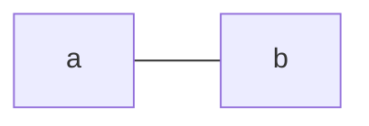

# testrepo

Test repo for Six Sigma Class

- Bullet Points
- Bullet Points

1. Hi
2. Bye

## Heading 2

### Heading 3

Type words

Make a code chunk

```r
library(dplyr)
# This is my R code
print("hello world")
```

### Mermaid Diagrams in Github



Add some code to add an image.


